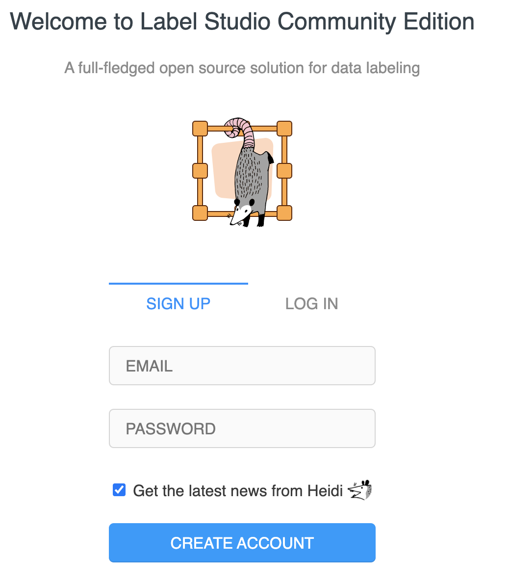
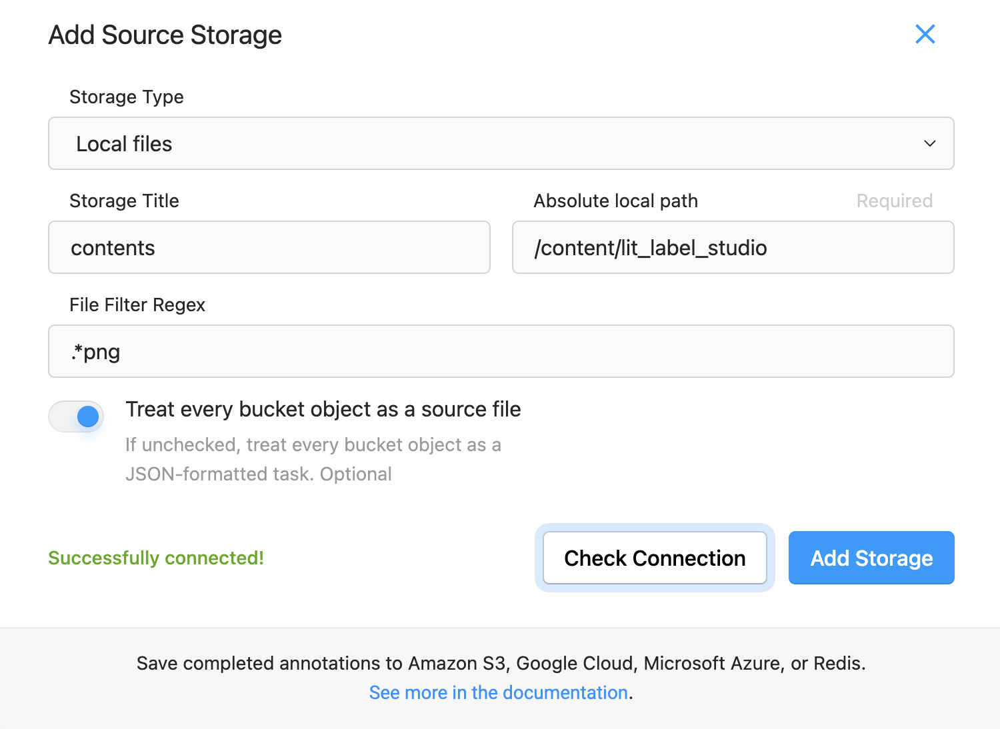

# lit_label_studio component

This ⚡ [Lightning component](lightning.ai) ⚡ was generated automatically with:

```bash
lightning init component lit_label_studio
```

## To run lit_label_studio

First, install lit_label_studio (warning: this app has not been officially approved on the lightning gallery).  This also uses Label Studio fork with x-frame-options support required for iFrame.

- Option git clone

```bash
git clone  https://github.com/Lightning-AI/lit_label_studio
cd lit_label_studio
python -m pip install -e .
```

- Option pip install

```bash
python -m pip install  https://github.com/Lightning-AI/lit_label_studio/archive/refs/tags/0.0.0.tar.gz
```

- Option lightning install

```bash
python -m lightning install component git+https://github.com/Lightning-AI/lit_label_studio.git@0.0.0
```

- verify

```
python -m pip show lit_label_studio
```

## on osx

```bash
brew install nginx
```

## Setup lit_label_studio virtualenv

NOTE: Use `Conda` for Lightning and use `venv` for Label Studio.
Label Studio and Lightning have library version conflict.
`venv` is used in the Lightning Cloud.

```bash
virtualenv ~/venv-label-studio
source ~/venv-label-studio/bin/activate;  python -m pip install label-studio; deactivate
```

- test label-studio

```bash
# --internal-host
# --port
source ~/venv-label-studio/bin/activate; label-studio; deactivate
```

- check

```
curl -i localhost:8080 | grep -i X-Frame-Options
```

## Potential error messages running locally

The `virtualenv` needs to be setup that has label-studio.

```
FileNotFoundError: [Errno 2] No such file or directory: 'label-studio'
```

Once the app is installed, use it in an app:

```python
from lit_label_studio import LitLabelStudio

import lightning.app as la


class LitApp(la.LightningFlow):
    def __init__(self) -> None:
        super().__init__()
        self.lit_label_studio = LitLabelStudio()

    def run(self):
        self.lit_label_studio.run()


app = la.LightningApp(LitApp())
```

## Run Locally and on the Cloud

Setting the `LABEL_STUDIO_X_FRAME_OPTIONS` is optional

```
export LABEL_STUDIO_X_FRAME_OPTIONS='sameorgin'
lightning run app app.py

lightning run app app.py --cloud --env LABEL_STUDIO_X_FRAME_OPTIONS='SAMEORGIN'
```

## Sign Up



## Lightning Drive usage inside Label Studio

On the cloud, Absolute local path for this app name is `/content/lit_label_studio`.  Replace `lit_label_studio` with your app name.

This behavior on controlled by the component.

```
'LABEL_STUDIO_LOCAL_FILES_SERVING_ENABLED':'true',
'LABEL_STUDIO_LOCAL_FILES_DOCUMENT_ROOT':os.path.abspath(os.getcwd())
```



# remove x-frame-options

- check the header

```
curl -I http://localhost:8080
```

## nginx

nginx  -c $(pwd)/nginx-8080.conf

## caddy

```
cat Caddyfile <<EOF
:8081
reverse_proxy 127.0.0.1:8080 {
    header_down X-Frame-Options "sameorgin"
}
EOF
```

caddy run &

## nginx
